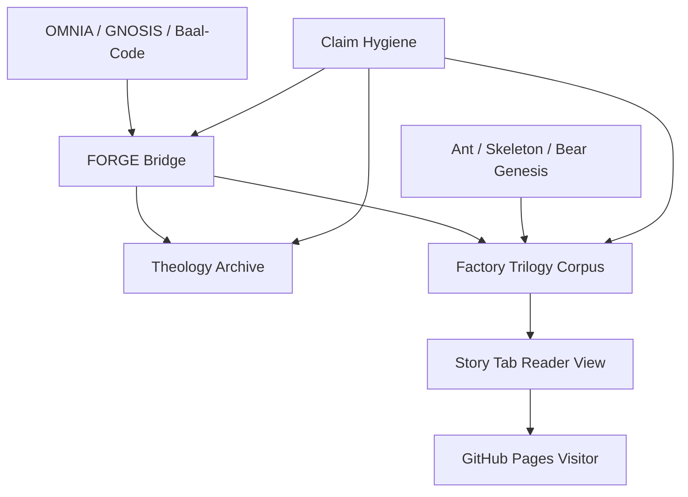

# Factory / OMNIA / Theology System Index

## Current merged stack

- PR #28 — OMNIA / Factory bridge + theology archive shelf
- PR #29 — Factory Trilogy shelf + trilogy index
- PR #30 — Full Factory Trilogy corpus
- PR #31 — Pre-Factory Ant / Skeleton / Bear Genesis
- PR #32 — Story tab routes to Factory Trilogy Archive

## Main layers

1. FORGE bridge:
   - docs/forge/OMNIA_FACTORY_INTEGRATION_MAP.md
   - docs/forge/SYMBOLIC_INTERFACE_READING_MAP.md

2. Theology archive:
   - docs/theology/
   - docs/theology/raw/
   - docs/theology/processed/
   - docs/theology/manifest.md
   - docs/theology/claim_cards/theology_archive_claims.yaml

3. Factory Trilogy corpus:
   - docs/visual_parables/factory_trilogy/

4. Website / Pages UI:
   - 06_applications/digital_sanctuary/
   - Story tab component:
     06_applications/digital_sanctuary/src/components/BedtimeStory.tsx

## System diagram

## Core mnemonic

OMNIA gives the law.
As Above gives the substrate.
Baal-Code gives the altar.
Gnosis gives the flame.
Factory gives the maintenance department.
Genesis gives the slow ant.
ConsMAP gives the tongs.

## Boundary

This corpus is symbolic / fictional / parabolic.
It is not evidence.
It is a structured archive for pattern-reading under ConsMAP claim hygiene.

Signal gre naprej. In vseeno.
